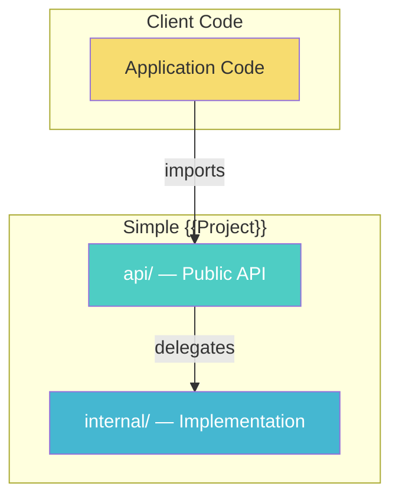
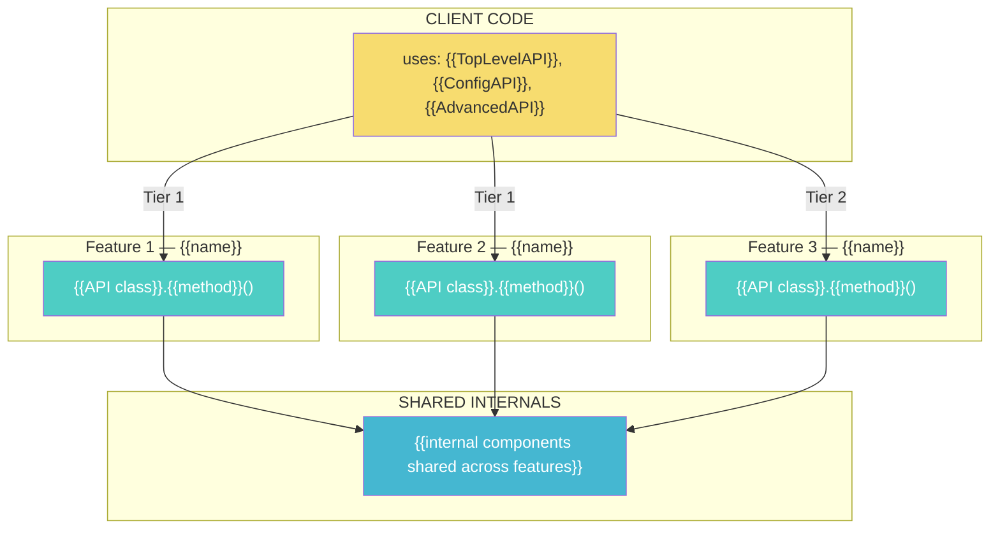
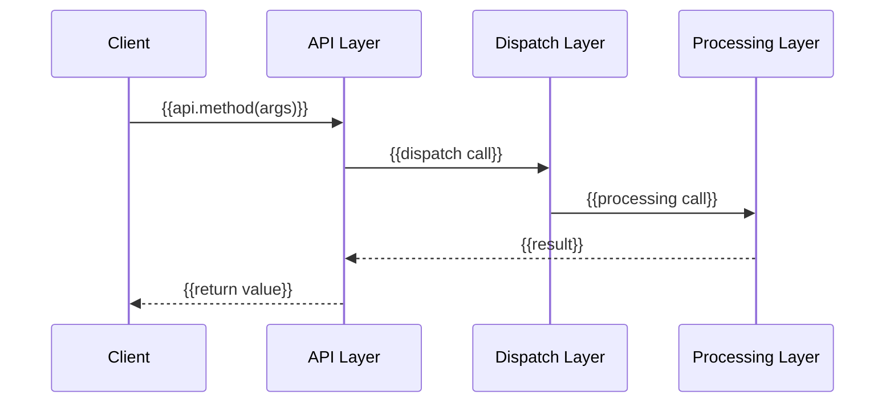
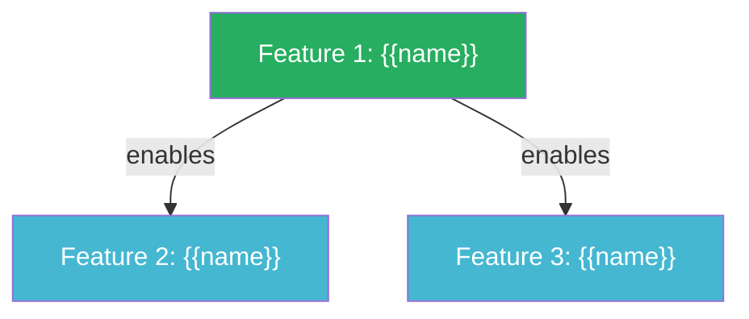

# Outline Template (API-First)

Use this template for the `api-outline.md` file. Replace all `{{placeholders}}`.

---

```markdown
# Simple {{Project Name}} — API-First Learning Outline

> Learn {{project}}'s API design by building a simplified Java version from the **outside in** —
> start with the APIs that clients actually call, then implement the internal machinery behind
> each one. Every design decision is a teaching moment with ★ Insight blocks and Mermaid visualizations.
>
> **Source**: {{Language}} ({{framework/library}}) → **Output**: Simplified Java

## Quick Start

```bash
# After implementing Feature 1, a client can already do:
{{minimal usage example — 3-5 lines showing the simplest API call}}
```

## Technology Mapping

| Source ({{Language}}) | Simplified Java Equivalent | Notes |
|-----------------------|---------------------------|-------|
| {{source concept 1}} | {{Java equivalent}} | {{why this mapping}} |
| {{source concept 2}} | {{Java equivalent}} | {{why this mapping}} |
| {{source concept 3}} | {{Java equivalent}} | {{why this mapping}} |

## Architecture Overview

{{One paragraph: what does this project do for its users? Not what it IS internally,
but what it DOES — what problem does a client solve by using it?}}

**Real-world analogy**: {{Analogy framed from the user's perspective — e.g., "Using FastAPI
is like having a receptionist who takes every visitor's request, validates it against a schema,
and routes them to the right handler."}}

<!-- diagram: architecture_overview -->


## API Surface Map

Shows which public API classes/interfaces belong to each feature:

<!-- diagram: api_surface_map -->


## Call Chain Diagrams

For each Tier 1 API, trace the execution path:

### {{API Method Name}} Call Chain

<!-- diagram: call_chain_{{method_slug}} -->


{{Repeat for each Tier 1 API}}

## Learning Path

<!-- diagram: learning_roadmap -->


**Recommended reading order:**

| Chapter | Feature | Tier | Prerequisites | Status |
| --- | --- | --- | --- | --- |
| Ch 01 | {{Feature 1 name}} | Tier 1 | None | ⬜ |
| Ch 02 | {{Feature 2 name}} | Tier 1 | Ch 01 | ⬜ |
| {{...}} | {{...}} | {{...}} | {{...}} | ⬜ |

## Features

### Feature 1: {{API Capability Name}} {{Tier: 1}}
⬜ Not started

**API Contract** (what clients call):
```java
// Client writes this:
{{code showing how a client uses this API — 3-8 lines}}
```

**What it does**: {{One sentence describing the capability from the user's perspective}}

> ★ **Insight** -------------------------------------------
> - **Why this is Feature 1?** {{Why this API capability comes first — usage frequency, simplicity, foundational internals}}
> - **Trade-off:** {{What's deferred by implementing this first}}
> - **Recommend:** {{What the learner will be able to do after this feature}}
> -----------------------------------------------------------

**Depth layers** (what gets built to support this API):

| Layer          | Simplified Java Class | Source Project Class/Function | Purpose                |
|----------------|----------------------|------------------------------|------------------------|
| API            | `Simple{{Name}}`     | `{{SourceClass/Function}}`   | {{what client imports}} |
| Dispatch       | `{{Name}}`           | `{{SourceClass/Function}}`   | {{routing/resolution}} |
| Processing     | `{{Name}}`           | `{{SourceClass/Function}}`   | {{core logic}}         |
| Infrastructure | `{{Name}}`           | `{{SourceClass/Function}}`   | {{if needed}}          |

**Real source files**: {{comma-separated list of key source files in the source project}}

**Depends on**: None (first feature)
**Complexity**: {{Low / Medium / High}} · {{estimated new classes}} new classes
**Java version**: {{8 / 11 / 17 / 21}}

**Concrete deliverables**:
- [ ] `api/{{ClassName}}.java` — {{what it provides}}
- [ ] `internal/{{ClassName}}.java` — {{what it does}}
- [ ] `api/{{ClassName}}Test.java` — client-perspective test
- [ ] `internal/{{ClassName}}Test.java` — internal unit test
- [ ] `api-docs/ch01_{{feature_name}}.md` — tutorial chapter

---

### Feature 2: {{API Capability Name}} {{Tier: 1|2}}
⬜ Not started

**API Contract** (what clients call):
```java
{{client usage code}}
```

**What it does**: {{one sentence, user perspective}}

**Depth layers**:

| Layer | Simplified Class | Source Project Class | Purpose |
|-------|------------------|----------------------|---------|
| API   | ...              | ...                  | ...     |
| ...   | ...              | ...                  | ...     |

**Real source files**: {{...}}

**Depends on**: Feature 1 (reuses {{specific internal component}})
**Complexity**: {{...}} · {{N}} new classes, {{M}} modified
**Java version**: {{...}}

**Concrete deliverables**:
- [ ] ...

---

{{Continue for all features...}}

## Implementation Notes

### Simplification Strategy

| Source Project Concept | Simplified Java Version | Why Simplified                            |
|------------------------|------------------------|-------------------------------------------|
| {{complex thing}}      | {{simple version}}     | {{reason — what learning goal it serves}} |
| {{complex thing}}      | Deferred               | {{not needed to understand the API}}      |

### In Scope
- {{API capabilities being implemented}}

### Out of Scope
- {{Internal optimizations not visible through the API}}
- {{Edge cases that don't affect the learning path}}

### Java Version
- Base: Java {{version}}
- Features using newer APIs: noted per-feature

## Status Markers
- ⬜ = not started
- ✅ = implemented, tests passing, tutorial written
```
