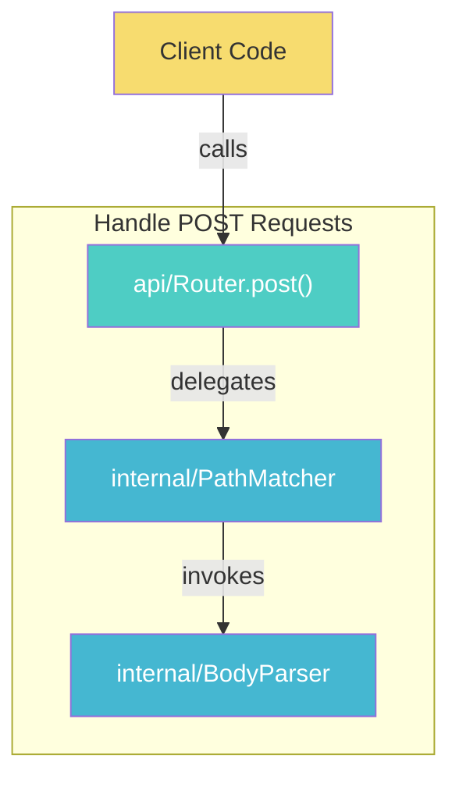
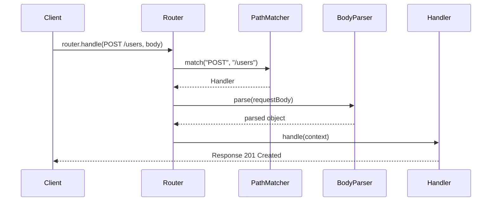

# Techniques for API-First Tutorials

These techniques create tutorials that teach frameworks from the outside in — starting
with the APIs clients call, then tracing inward to understand the implementation.

---

## 1. API Contract First

**What**: Show the public API — class name, method signatures, return types, Javadoc — before
any implementation code. The reader sees what they're building toward before they see how.

**Why**: This mirrors how developers actually learn frameworks — they read the API docs first,
try to use the API, then dig into source code when something doesn't work or they want to
extend it. Starting with the contract creates immediate motivation: "I can see what this
does for me, now I want to know how."

**Structure**:
```java
// What the client sees:
public interface HttpRouter {
    void get(String path, Handler handler);
    void post(String path, Handler handler);
    Response handle(Request request);
}
```

Show this BEFORE the implementation class. The reader understands the capability before
the machinery.

**Exception**: Chapter 1 may not have a meaningful API contract if it's bootstrapping the
core framework object. In that case, the "API" is the framework's constructor or factory
method.

---

## 2. Client Test as Specification

**What**: Write tests from the client's perspective BEFORE the implementation. These tests
compile against the API contract and define what "working" means.

**Why**: Tests-first is more than a development technique here — it's a pedagogical tool.
The test IS the specification. When a reader sees:

```java
@Test
void shouldRouteGetRequest_WhenPathMatches() {
    router.get("/users", ctx -> ctx.json(userList));
    var response = router.handle(Request.get("/users"));
    assertEquals(200, response.status());
}
```

They immediately understand what the API does WITHOUT reading any explanation. The test
name (`shouldRouteGetRequest_WhenPathMatches`) is a sentence that describes the behavior.

**Naming**: Use `should<ExpectedBehavior>_When<Condition>`. Someone reading only test names
should understand the full API contract.

**Distinction from v1**: V1 writes tests after implementation (test-as-validation). V2 writes
client-perspective tests before implementation (test-as-specification), then adds internal
unit tests after.

---

## 3. Call Chain Tracing

**What**: Implement each depth layer in call-chain order (top-down), showing how a client's
API call flows through the system.

**Why**: This is the core pedagogical technique of v2. Instead of building components
bottom-up and hoping the reader understands how they connect, you trace a single API call
from entry to exit:

```
Client calls router.handle(request)
  → Router.handle() looks up the registered handler  [API layer]
  → PathMatcher.match() finds the matching route     [Dispatch layer]
  → Handler.handle() executes the user's code        [Processing layer]
  → Response is constructed and returned              [Back up the stack]
```

Each layer is implemented in this order. After implementing the API layer, run the tests
(they'll fail at the delegation point). After implementing dispatch, run again (closer).
After processing, tests pass.

**Depth levels** (not every feature uses all of them):
| Level | Purpose | Example |
|-------|---------|---------|
| API | Entry point clients call | `Router.handle()` |
| Dispatch | Routing, resolution, lookup | `PathMatcher.match()` |
| Processing | Core logic, transformation | `Handler.handle()` |
| Infrastructure | I/O, caching, threading | `ConnectionPool.get()` |

---

## 4. Vertical Slice Presentation

**What**: Each chapter implements one complete API capability — from the public API method
down through every internal layer needed to make it work.

**Why**: The reader gets a working, callable API at the end of every chapter. They never
build internal components in isolation wondering "what is this for?" Every piece of code
has an immediate, concrete purpose: making a specific API call work.

**Contrast with v1**: V1 chapters build horizontal layers (the router, the serializer,
the config system). V2 chapters build vertical slices (handle GET requests, configure
custom serializers, register middleware). V1 components become useful when all layers
are assembled. V2 slices are useful immediately.

**The reuse pattern**: Later features reuse and extend internals from earlier features.
Feature 3 doesn't build a new dispatcher — it extends Feature 1's dispatcher to handle
a new case. The "What We Enhanced" table tracks this growth.

---

## 5. Build Challenge Framing

**What**: Table showing Current State | Limitation | Objective. ONE row only.

**Why**: Frames the chapter as solving a concrete limitation. The reader knows exactly
what they can't do yet and what they'll be able to do after this chapter.

| Current State | Limitation | Objective |
|--------------|-----------|-----------|
| Framework handles GET requests | No support for POST with request body | Handle POST requests with JSON body parsing |

**Rules**: Always one row. Focus on the API capability gap, not internal components.
The limitation and objective should be stated from the client's perspective.

---

## 6. Try It Yourself Challenges

**What**: Collapsible `<details>` sections with challenges that extend the API or internals.

**Why**: Active learning beats passive reading. Challenges should follow naturally from
the chapter's API capability.

**Good challenges**:
- Extend the API with a related method (e.g., "add a `DELETE` method to the router")
- Add a missing edge case to the dispatch logic
- Enhance an internal component (e.g., "make the path matcher support wildcards")

**Bad challenges**:
- Unrelated to this chapter's API capability
- Require knowledge from future chapters
- Pure refactoring with no behavioral change

---

## 7. Source Code Mapping Tables

**What**: Three levels of mapping between simplified Java code and source project code (any language).

### Per-chapter mapping (in N.8)
| Simplified Java | Source Project ({{Language}}) | Source Reference |
|-----------------|-------------------------------|-----------------|
| `simple.api.Router` | `io.javalin.Javalin` (Java) or `fastapi.FastAPI` (Python) | `Javalin.java:45` or `applications.py:12` |

### Cross-language technology mapping (in N.8, for non-Java sources)
| Source Concept | Java Equivalent | Rationale |
|---------------|-----------------|-----------|
| Python `@app.get("/")` decorator | `router.get("/", handler)` fluent method | Java lacks decorator syntax; fluent API achieves the same registration pattern |
| Go `http.HandleFunc` | `router.get(path, handler)` | Direct mapping — both register path-to-handler associations |

### Cross-chapter evolution (in enhancement table)
Track how a simplified class grows across chapters to approach the source project's
functionality.

### Cross-file relationships
When a simplified class maps to multiple source classes/modules (because the simplified version
merges responsibilities), document this explicitly.

**Important**: Include commit hash. Source code references go stale — the hash lets
readers verify against the exact version you analyzed.

---

## 8. Enhancement Tracking Tables

**What**: "What We Enhanced" table, mandatory for ch02+, skip ch01.

| Component | Before (Ch N-1) | Current (Ch N) | Source Project |
|-----------|----------------|----------------|----------------|
| PathMatcher | Exact string match | Supports path parameters `/users/:id` | Regex + path templates |

**Why**: Shows the reader that simplifications are temporary. Each chapter enhances
previous internals to support new API capabilities. The "Source Project" column shows
what's left — the gap between current state and the source project's capability shrinks every chapter.

**Rules**:
- At least one row per chapter (ch02+)
- Focus on changes that were driven by the new API capability
- The "Before" column must match the "Current" column from the previous chapter

---

## 9. Before/After Code Comparison

**What**: When modifying code from a previous chapter, show what changed.

**Format for small changes** (< 5 lines):
```java
// Before (Ch 2):
public Response handle(Request request) {
    Handler handler = routes.get(request.path());
    return handler.handle(request);
}

// After (Ch 3) — added method matching:
public Response handle(Request request) {
    RouteKey key = new RouteKey(request.method(), request.path());
    Handler handler = routes.get(key);
    return handler.handle(request);
}
```

**Format for large changes**: Describe the change in prose, show only the modified method,
and include the full file in the Complete Code section.

---

## 10. Rich Mermaid Visualization

**What**: Mermaid diagrams throughout tutorials — vertical slice diagrams, call chain traces,
architecture overviews, feature dependency graphs — all using the standardized 7-color palette.

**Why**: Visual diagrams accelerate understanding of:
- Vertical slice structure (which layers a feature touches)
- Call chain execution flow (sequence diagrams)
- Component relationships (flowchart diagrams)
- Feature progression (how internals grow across chapters)

**Rules**:
- Every Mermaid block has `<!-- diagram: slug_name -->` comment above it
- All arrows labeled with data type, protocol, or relationship
- Subgraphs for logical grouping
- Standardized colors: Teal (API surface), Blue (internal logic), Purple (infrastructure),
  Orange (config), Red (error), Green (success), Yellow (external/client)
- GitHub-renderable only

**Example — Vertical Slice**:
```markdown
<!-- diagram: ch02_post_handler_vertical_slice -->


**Example — Call Chain Sequence**:
```markdown
<!-- diagram: ch02_post_call_chain -->


**ASCII as supplement**: For inline call chain traces within tutorial prose where
a quick visual suffices, ASCII diagrams can supplement (not replace) Mermaid:
```
Client: router.handle(POST /users, body)
  ├─► [Router] look up route → PathMatcher
  ├─► [BodyParser] parse JSON body
  └─► [Handler] execute create() → Response 201
```

---

## 11. Structured Insight Blocks

**What**: Educational blocks explaining WHY design decisions work, with a structured
6-field format for maximum learning value.

**Format**:
```markdown
> ★ **Insight** -------------------------------------------
> - **Why [topic]?** [Rationale with alternatives considered]
> - **Trade-off:** [What was sacrificed. Downsides. When this choice might be wrong.]
> - **Recommend:** [For the learner: when to use this approach vs. alternatives]
> - **Where:** [→ src/path/File.java — methodName]
> - **When:** [During init? Runtime? Under load?]
> - **How to verify:** [Test, log output, or metric that confirms understanding]
> -----------------------------------------------------------
```

**Rules**:
- **Placement**: In TWO places — N.3 (at design decision points during implementation) AND N.6 (comprehensive insights)
- **Minimum fields**: Every insight MUST have: **Why** + **Trade-off** + **Recommend**
- **Full fields**: Include all 6 fields when information is available
- 1-3 comprehensive insights in N.6 per chapter
- Focus on WHY, not WHAT
- Connect to the source project's approach
- Include trade-offs (no design is universally optimal)
- Lower-impact insights use collapsible `<details>` blocks

**Good insight topics for API-first**:
- Why the API is designed this way (fluent vs. annotation vs. config file)
- Why the internal layering exists (separation of concerns, testability)
- Why a specific simplification was chosen at a depth layer
- Why the source project is more complex at this layer (performance, edge cases, backwards compatibility)
- Why simplifications are safe here (the deferred complexity doesn't affect the API contract)

**Bad insight topics**:
- Describing what code does (the code is right there)
- Generic Java advice ("use interfaces for abstraction")
- Repeating what the framework's documentation says

---

## 12. Code-First Presentation

**What**: Code BEFORE explanatory text. Always.

**Why**: Code is the truth. Prose is commentary. The reader should form their own
understanding from the code, then have it confirmed and deepened by the explanation.

**Pattern**:
```markdown
### N.3.2 PathMatcher — route resolution

```java
public class PathMatcher {
    // ... code ...
}
`` `

The PathMatcher receives the request path from the Router and checks it against
registered patterns. It returns the matching Handler, or throws NoRouteException
if no pattern matches.
```

NOT:
```markdown
### N.3.2 PathMatcher — route resolution

The PathMatcher is responsible for matching request paths to registered handlers.
It implements a simple exact-match algorithm that we'll enhance in later chapters.

```java
public class PathMatcher {
    // ... code ...
}
`` `
```

---

## 13. Package Convention: api/ vs internal/

**What**: Split source code into `api/` (public) and `internal/` (implementation).

**Why**: This isn't just organization — it's the physical manifestation of the API-first
philosophy. The `api/` package contains everything a client imports. The `internal/`
package contains everything that makes it work. This boundary is the most important
line in the codebase.

**Test mirroring**: Tests follow the same split:
- `test/api/` — client-perspective tests (test the contract)
- `test/internal/` — unit tests for internal components (test the machinery)

A reader can understand the full API by reading only `api/` and `test/api/`. They
never need to look at `internal/` to USE the framework — only to UNDERSTAND or
CONTRIBUTE TO it. That's the whole point of the outside-in approach.

---

## 14. Technology Substitution Mapping

**What**: When the source project is in a different language (Python, Go, Rust, Node.js, C#,
Ruby, etc.), document how each source language concept maps to a Java equivalent in the
simplified implementation.

**Why**: Cross-language reimplementation is a powerful learning technique — it forces deep
understanding of WHAT a concept does (behavior) vs. HOW a language expresses it (syntax).
The mapping table makes these translations explicit and educational.

**Structure**: A lightweight mapping table in the outline and in each tutorial chapter's N.8 section:

| Source Concept (Language) | Java Equivalent | Why This Mapping |
|---------------------------|-----------------|------------------|
| Python `@app.get("/")` decorator | `router.get("/", handler)` fluent method | Java lacks decorators; fluent API preserves the registration intent |
| Go `func(w http.ResponseWriter, r *http.Request)` | `Handler` functional interface | Both are function signatures for request handling |
| Rust `async fn` + `impl Responder` | `Handler` returning `Response` | Simplified away async; kept the response contract |
| Node.js `app.use(middleware)` | `router.use(filter)` | Direct mapping; middleware = filter in Java servlet terms |
| C# `[HttpGet("/")]` attribute | `@Get("/")` annotation or fluent `.get()` | Both are metadata-driven route registration |

**Rules**:
- Keep mappings lightweight — a table per feature, not an exhaustive language comparison
- Focus on mappings relevant to THIS feature's API capability
- Explain WHY the Java equivalent was chosen, not just WHAT it is
- Note when the Java version is simpler (common) or more complex (rare) than the source
- This is NOT a full deviation report (that's enterprise-learning) — just a mapping table
