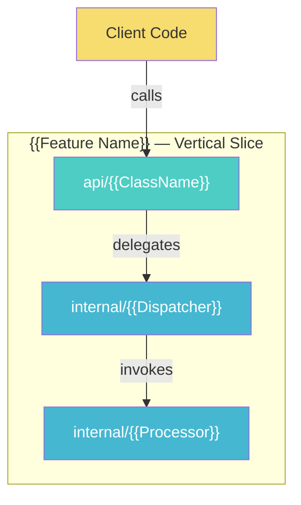
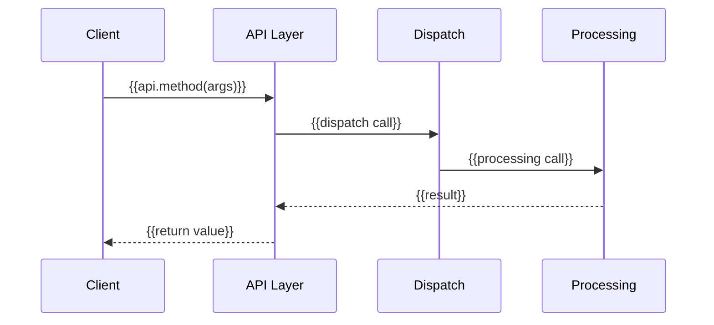

# Tutorial Template (API-First — 10-Section Structure)

Each chapter is `api-docs/chNN_<feature_name>.md`. Replace `N` with the chapter number
and `{{placeholders}}` with actual content.

**IMPORTANT**: Every chapter MUST have all 10 sections. If a section doesn't apply to this
feature, include it with: "N/A — this feature does not involve [topic]" and a brief explanation.

---

```markdown
# Chapter N: {{Feature Name}}

## N.1 The API Contract

**Build Challenge:**

| Current State         | Limitation                     | Objective                                  |
|-----------------------|--------------------------------|--------------------------------------------|
| {{what exists now}}   | {{what clients can't do yet}}  | {{what clients will be able to do}}        |

After this chapter, clients can write:

```java
{{3-8 lines showing the API in use — this is what we're building toward}}
```

The public API for this feature:

```java
// api/{{ClassName}}.java — what clients import
{{public class/interface with method signatures and Javadoc}}
```

{{For MODIFIED API classes: state which file changes and show only the new methods/changes}}

## N.2 Client Tests — Proving the Contract

Before implementing anything, these tests define what "correct" means:

```java
// api/{{ClassName}}Test.java
{{full test class with 2-4 tests covering the API's behavioral contract}}
```

These tests won't compile yet — we haven't implemented the API. That's intentional.
Each test represents a promise the API makes to its clients.

{{Explain each test briefly — what contract does it verify?}}

## N.3 Implementing the Call Chain

Now we build each layer to make those tests pass.

### N.3.1 {{Layer Name}} — {{purpose}}

{{For the API layer (first layer):}}
This is the entry point — the public class clients import:

```java
// api/{{ClassName}}.java [NEW] or [MODIFIED]
{{full implementation code}}
```

{{For NEW files: show complete code}}
{{For MODIFIED files: state the file, describe what changed, show the diff or the new method}}

> ★ **Insight** -------------------------------------------
> - **Why {{design decision}}?** {{Rationale with alternatives considered}}
> - **Trade-off:** {{What was sacrificed, downsides}}
> - **Recommend:** {{When to use this approach}}
> -----------------------------------------------------------

{{Explain what this layer does and what it delegates to the next layer}}

### N.3.2 {{Next Layer Name}} — {{purpose}}

```java
// internal/{{ClassName}}.java [NEW]
{{full implementation code}}
```

{{Explain: what does this class receive from the layer above?
What does it do? What does it return/delegate?}}

> ★ **Insight** -------------------------------------------
> - **Why {{simplification or pattern choice}}?** {{Rationale}}
> - **Trade-off:** {{What the source project does differently and why}}
> - **Recommend:** {{Guidance for real projects}}
> -----------------------------------------------------------

{{Continue for each depth layer...}}

### N.3.3 {{Deepest Layer}} — {{purpose}}

```java
// internal/{{ClassName}}.java [NEW]
{{implementation}}
```

{{Explain the bottom of the call chain — where does the work actually happen?}}

**Run the client tests now — they should all pass.**

## N.4 Internal Tests

With the vertical slice working, add targeted tests for internal components:

```java
// internal/{{ClassName}}Test.java [NEW]
{{unit tests for non-trivial internal logic — edge cases, error handling}}
```

## N.5 Try It Yourself

<details>
<summary>Challenge 1: {{description of what to extend}}</summary>

**Hint**: {{which layer to modify and what to add}}

**Solution**:
```java
{{solution code}}
```
</details>

<details>
<summary>Challenge 2: {{description}}</summary>

**Hint**: {{hint}}

**Solution**:
```java
{{solution code}}
```
</details>

## N.6 Why This Works

> ★ **Insight** -------------------------------------------
> - **Why {{core design decision for this feature}}?** {{Deep rationale with alternatives considered}}
> - **Trade-off:** {{What was sacrificed, downsides, when this choice might be wrong}}
> - **Recommend:** {{For the learner: when to use this approach in real projects}}
> -----------------------------------------------------------

{{1-3 insight blocks. Focus on WHY the design works, not WHAT the code does.
Topics should cover the most impactful design decisions in this feature:
- API design rationale (fluent vs annotation vs config)
- Layer boundary justification
- Simplification decision reasoning
- How the source project handles this differently and why}}

## N.7 What We Enhanced

{{FOR CHAPTER 1:}}

**Foundation established.** This chapter created the core API and internal machinery:

| Component | What Was Created | Purpose |
|-----------|-----------------|---------|
| {{component}} | {{what was built}} | {{why it exists}} |

{{FOR CHAPTER 2+: This table is MANDATORY.}}

| Component     | Before (Ch {{N-1}})  | Current (Ch {{N}})  | Source Project                  |
|---------------|----------------------|---------------------|---------------------------------|
| {{component}} | {{previous state}}   | {{current state}}   | {{what source project does}}    |

{{At least one row per chapter. Show how internals grow to support new API capabilities.}}

## N.8 Connection to Source Project

| Simplified Java              | Source Project ({{Language}})  | Source Reference                  |
|------------------------------|-------------------------------|-----------------------------------|
| `simple.api.{{Class}}`      | `{{source.package.Class/Function}}` | [`{{file}}:{{line}}`]({{url}})    |
| `simple.internal.{{Class}}` | `{{source.package.Class/Function}}` | [`{{file}}:{{line}}`]({{url}})    |

{{IF source language is not Java, include technology mapping:}}

**Technology Mapping ({{Language}} → Java)**:

| Source Concept ({{Language}}) | Java Equivalent | Rationale |
|-------------------------------|-----------------|-----------|
| {{source concept}}            | {{Java equivalent}} | {{why this mapping was chosen}} |

Verified against commit: `{{short-hash}}`

## N.9 Architecture Visualization

<!-- diagram: ch{{NN}}_{{feature_slug}}_vertical_slice -->


{{Additional diagrams as needed:}}

{{FOR features with complex call chains:}}
<!-- diagram: ch{{NN}}_{{feature_slug}}_call_chain -->


## N.10 Complete Code

All files created or modified in this chapter. Copy all `[NEW]` files and replace
all `[MODIFIED]` files to get a compiling project with all tests passing.

### Production Code

#### `src/main/java/simple/{{framework}}/api/{{ClassName}}.java` [NEW]
```java
{{FULL file content — read from actual src/ file, do NOT write from memory}}
```

#### `src/main/java/simple/{{framework}}/internal/{{ClassName}}.java` [NEW]
```java
{{FULL file content}}
```

{{Include ALL files created or modified, in dependency order}}

### Test Code

#### `src/test/java/simple/{{framework}}/api/{{ClassName}}Test.java` [NEW]
```java
{{FULL file content}}
```

#### `src/test/java/simple/{{framework}}/internal/{{ClassName}}Test.java` [NEW]
```java
{{FULL file content}}
```

## Summary

| Concept       | What You Built                              |
|---------------|---------------------------------------------|
| {{concept 1}} | {{what it does in your simplified version}} |
| {{concept 2}} | {{what it does}}                            |

**Next chapter**: {{Feature N+1 name}} — {{one sentence about what API capability comes next
and what new internal machinery it will require}}
```

---

## Template Rules

1. **All 10 sections**: Every chapter has N.1 through N.10. Mark inapplicable sections "N/A — this feature does not involve [topic]" rather than omitting.
2. **Build Challenge**: ONE row only. Current state → Limitation → Objective.
3. **API Contract comes FIRST**: Show what clients will call before any implementation.
4. **Client tests before implementation**: Tests define the contract, implementation fulfills it.
5. **Call chain order**: Implement top-down (API → Dispatch → Processing → Infrastructure).
6. **★ Insight blocks at decision points**: In N.3 (implementation) AND N.6 (Why This Works), with minimum Why + Trade-off + Recommend.
7. **Code before explanation**: Show the code, then explain what it does and why.
8. **File annotations**: Every code block header states the file path and `[NEW]` or `[MODIFIED]`.
9. **Modified files**: State the file, describe the change, show the specific change.
10. **Complete Code**: Generated by reading actual `src/` files. Must match reality exactly.
11. **Architecture Visualization (N.9)**: At least one Mermaid diagram per chapter, using standardized color palette and `<!-- diagram: slug -->` markers.
12. **What We Enhanced (N.7)**: Foundation table for ch01. MANDATORY enhancement table for ch02+.
13. **Copy-paste guarantee**: If reader copies `[NEW]` files and replaces `[MODIFIED]` files, the project compiles and all tests pass.
14. **Mermaid diagrams**: Use standardized 7-color palette, `<!-- diagram: slug -->` comment markers, labeled arrows, subgraphs for logical grouping.
15. **Emoji markers**: 🔑 Essential, ⚠️ Pitfall, 🚫 Constraint, ★ Insight, 🔄 Call chain — used consistently.
