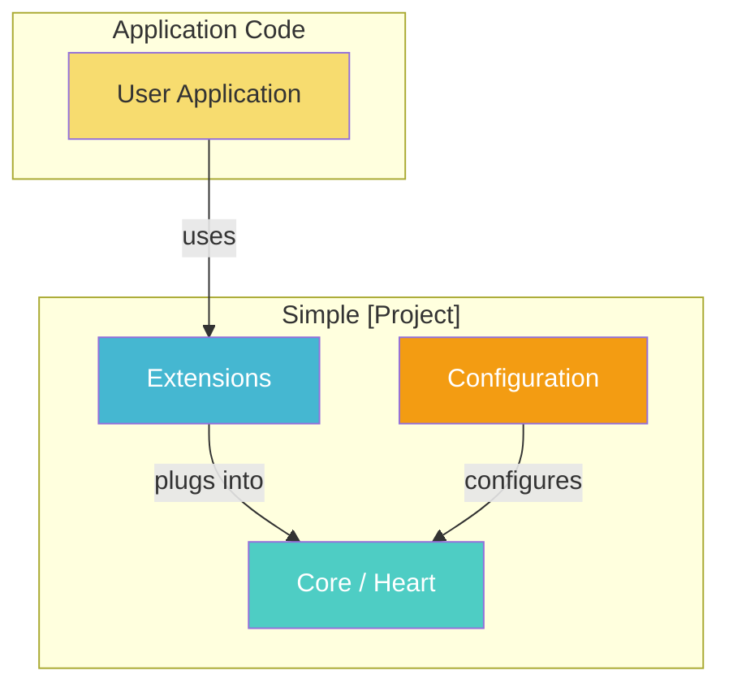
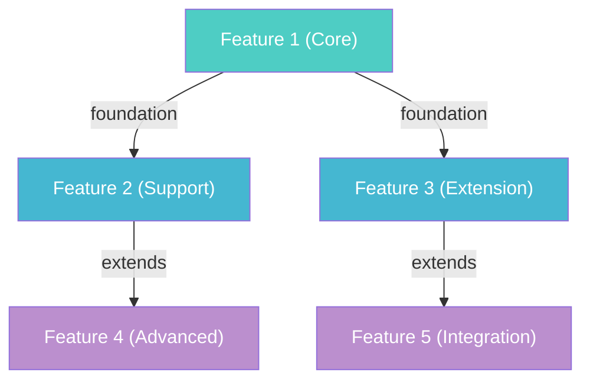
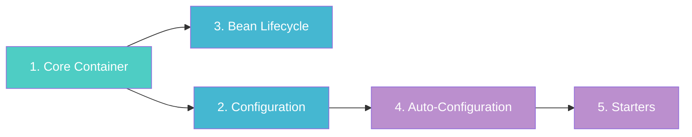
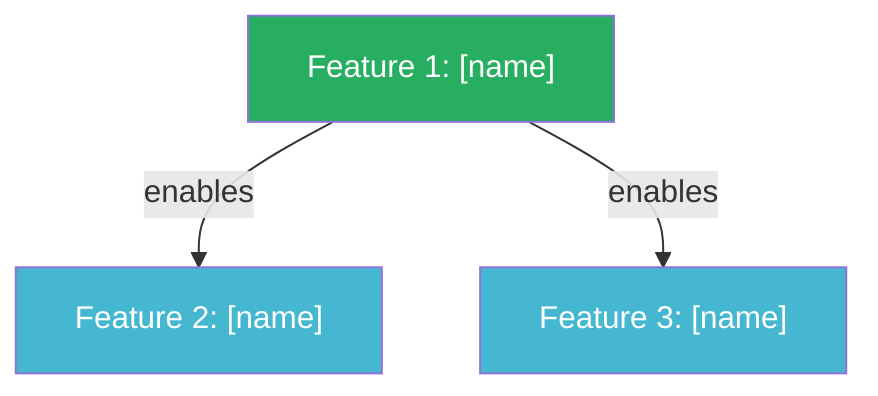

# Outline Template (Core-First)

Use this template for `simple-<project-name>/core-outline.md`. Adapt section content to the specific project.

---

```markdown
# Outline: Simple [Project Name]

> Learning [Project Name] by building a simplified Java version from source — starting from
> the **heart** and building outward. Every design decision is a teaching moment with
> ★ Insight blocks and Mermaid visualizations.
>
> **Source:** [Language] — [Project Name] repository at commit `<short-hash>`
> **Output:** Simplified Java (JDK 17+, JUnit 5, AssertJ)

## Quick Start

1. Browse the feature list below and pick one (start from #1 if this is your first time)
2. Run `/core-builder "<feature name>"`
3. The skill will generate:
   - A tutorial guide in `core-docs/chNN_<feature_name>.md`
   - Working Java code in `src/main/java/`
   - Tests in `src/test/java/`
4. Read the tutorial, explore the code, or delete it and rebuild from the tutorial

## Technology Mapping

| Source ([Language]) | Java Equivalent | Rationale |
|---------------------|----------------|-----------|
| [Source construct 1] | [Java equivalent] | [Why this mapping] |
| [Source construct 2] | [Java equivalent] | [Why this mapping] |
| [Source idiom]       | [Java pattern]    | [How the concept translates] |

## Architecture Overview

[One paragraph describing what this project does and its core philosophy]

**Real-world analogy:** [Analogy mapping to 3+ project components]

<!-- diagram: architecture_overview -->


### Component Diagram

<!-- diagram: component_relationships -->


### Dependency Graph

<!-- diagram: dependency_graph -->


## Learning Path

<!-- diagram: learning_roadmap -->


**Recommended reading order:**

| Chapter | Feature | Integration Point | Prerequisites | Status |
| --- | --- | --- | --- | --- |
| Ch 01 | [Feature 1 name] | Core (foundation) | None | ⬜ |
| Ch 02 | [Feature 2 name] | [where it plugs in] | Ch 01 | ⬜ |
| [...]  | [...]              | [...]               | [...]  | ⬜ |

## Features

### 1. [Feature Name] ⬜
- **Description:** [One-line: what this component does in the project]
- **Depends on:** None
- **Integration point:** 🔗 Core (foundation — this IS the heart)
- **Maps to:** `real/source/path/Package.java`, `real/source/path/Other.java`
- **Complexity:** Low / Medium / High
- **Java version:** 17 (or 21+ if needed, with reason)
- **What you'll build:** [Concrete deliverable — e.g., "A minimal IoC container that registers and resolves beans by type"]

> ★ **Insight** -------------------------------------------
> - **Why this is the heart?** [Evidence and reasoning for why this is the minimal core]
> - **Trade-off:** [What this means for the build sequence — what must wait]
> - **Recommend:** [What the learner will understand after building this]
> -----------------------------------------------------------

### 2. [Feature Name] ⬜
- **Description:** [One-line]
- **Depends on:** Feature 1
- **Integration point:** 🔗 [Exact method/class where this plugs into the existing system]
- **Maps to:** `real/source/path/`
- **Complexity:** Low / Medium / High
- **Java version:** 17
- **What you'll build:** [Concrete deliverable]

[... continue for all features ...]

## Implementation Notes

### Simplification Strategy
[Brief description of what the simplified Java version will and will NOT cover]

| Source Project Concept ([Language]) | Simplified Java Version | Why Simplified |
| --- | --- | --- |
| [complex thing] | [simple Java version] | [reason — what learning goal it serves] |

**In scope (happy path):**
- [Core behavior 1]
- [Core behavior 2]

**Out of scope (edge cases / advanced):**
- [Advanced feature 1]
- [Advanced feature 2]

### Java Version
- **Baseline:** Java 17
- **Features requiring 21+:** [List any, or "None"]

## Status Markers
- ⬜ = Not yet implemented
- ✅ = Implemented and tests passing
```
