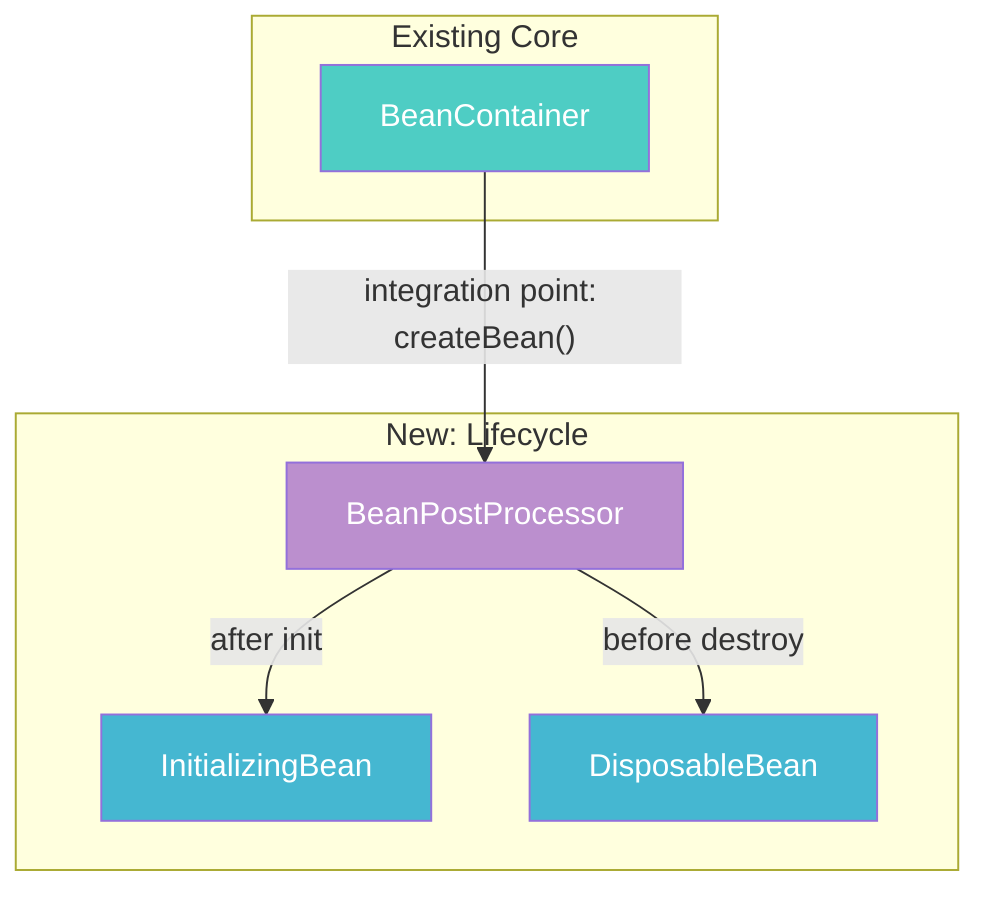
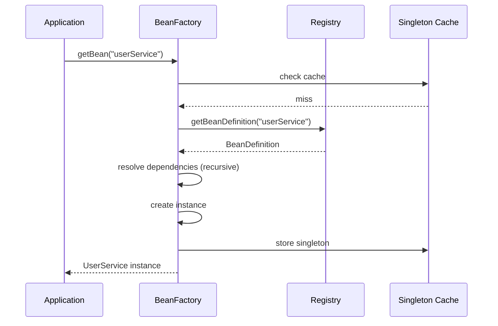
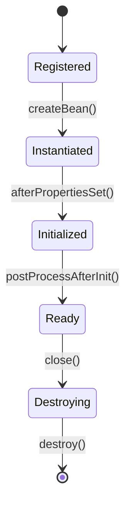

# Techniques Catalog

Proven patterns for creating effective code-first tutorials. Each technique includes what it is, why it matters, and a concrete example.

---

## 1. Integration Point First

**What**: Show the code where two subsystems connect BEFORE building the supporting components. The integration point is the heart of each feature — it reveals the direction and purpose of everything else.

**Why**: When learners see `converter.convert(value, targetType)` inside a resolver first, they immediately know WHY they're building a conversion service. When they see `chain.applyPreHandle()` in a dispatch method first, they understand the interceptor lifecycle before implementing a single interceptor. Starting with the integration point provides a mental roadmap — the learner knows where they're going before they start walking.

**How to identify the integration point:**
- Where does an existing class gain a new field or dependency?
- Where does a new method call appear in an existing pipeline?
- Where does a configuration step connect two independent subsystems?

**The 5 common locations** (observed across progressive framework rebuilds):
1. **Central dispatch pipeline** — features adding a step to the main processing loop (interceptors, exception resolvers, view rendering, session management)
2. **Adapter/invoker pipeline** — features changing how handlers are invoked or results written (argument resolution, return value handling, data binding)
3. **Resolver/converter internals** — features adding capabilities to existing resolvers (type conversion, validation)
4. **Registry/mapping** — features changing how inputs map to handlers (pattern matching, meta-annotations, filtering)
5. **Server/container infrastructure** — features connecting to the embedded server or container bootstrap (servlet mapping, component scanning, protocol support)

**Anti-pattern (bottom-up — wrong order):**
```markdown
## 5.1 The @Param Annotation
## 5.2 The ParameterMetadata Wrapper
## 5.3 The Resolver Interface
## 5.4 The ParamResolver Implementation
## 5.5 Wire into the Adapter  ← integration point buried last
```

**Correct (integration-point-first):**
```markdown
## 5.1 The Integration Point: Adapter gains resolveArguments()
[Show the modified handle() method — resolveArguments() before doInvoke()]
[Direction: "We need resolvers that extract values from requests."]
## 5.2 @Param annotation + ParameterMetadata
## 5.3 Resolver interface + composite + ParamResolver
## 5.4 Wire it all together
```

**Another example (interceptors feature):**
```markdown
## 10.1 The Integration Point: dispatch() wraps handler execution
[Show dispatch() calling chain.applyPreHandle() / applyPostHandle() / afterCompletion()]
[Direction: "We need an Interceptor interface and an ExecutionChain that manages the lifecycle."]
## 10.2 The Interceptor Interface
## 10.3 The ExecutionChain
```

**Exception — foundation chapters:** Chapter 1 (e.g., "Bean Container") has no prior system to integrate with. In this case, section N.1 shows the core data structure and states what future features will connect to it: "This container will be the glue that all future features retrieve their collaborators from."

---

## 2. Code-First Presentation

**What**: Present code BEFORE explanatory text. Always.

**Why**: Code is the truth. Prose is commentary. The reader should form their own understanding from the code, then have it confirmed and deepened by the explanation.

**Anti-pattern (explanation-first — avoid):**
```markdown
## 5.1 Understanding the Factory Pattern
The Factory Pattern is a creational design pattern that provides an interface
for creating objects without specifying their exact classes...
[3 paragraphs]
Now let's see the code:
```

**Correct (code-first):**
```markdown
## 5.1 Extract the Factory Interface
```java
public interface HttpRequestFactory {
    HttpRequest createRequest(URI uri, String method) throws IOException;
}
```‎
```

**Rules:**
- No explanatory paragraphs before code blocks in sections N.1–N.4
- Section headers describe what to BUILD, not what to learn ("Extract the Factory Interface" not "Understanding Factories")
- Minimal inline comments — just enough to orient, not explain the pattern

---

## 3. Build Challenge Framing

**What**: Table showing Current State | Limitation | Objective. ONE row only.

**Why**: Frames the chapter as solving a concrete limitation. The reader knows exactly what they can't do yet and what they'll be able to do after this chapter.

**Example:**
```markdown
## Build Challenge
| Current State | Limitation | Objective |
|---------------|------------|-----------|
| `body()` directly creates `HttpURLConnection` to make HTTP calls | Cannot swap HTTP libraries; cannot unit-test without a real network | Extract HTTP transport behind a factory interface so implementations are pluggable |
```

**Guidelines:**
- ONE row only — if you need multiple rows, the chapter covers too much
- "Limitation" must be specific and testable, not vague
- "Objective" uses a verb phrase (BUILD something)

---

## 4. Try It Yourself Challenges

**What**: Collapsible `<details>` sections with challenges that extend the feature or internals.

**Why**: Active learning beats passive reading. Challenges should follow naturally from the chapter's feature. Since the actual code exists in `src/`, the user has options:
- Try implementing from the challenge description
- Peek at the solution in the `<details>` tag
- Look at the actual source files directly
- Delete the source files and rebuild from the tutorial

**Example:**
```markdown
## N.4 Try It Yourself

<details>
<summary>Challenge: Create a type-safe bean resolver that finds beans by their interface type</summary>

Think about: How do you match a registration of `UserServiceImpl.class` when someone asks for `UserService.class`?

```java
public <T> T resolve(Class<T> type) {
    return registrations.entrySet().stream()
        .filter(e -> type.isAssignableFrom(e.getKey()))
        .map(e -> type.cast(e.getValue().get()))
        .findFirst()
        .orElseThrow(() -> new NoSuchBeanException(type));
}
```‎

</details>
```

---

## 5. Test-as-Documentation

**What**: Tests serve as living documentation — their names describe the feature's behavior.

**Why**: Someone reading only test names should understand what the feature does. Test naming IS the specification.

**Example:**
```java
class BeanContainerTest {

    @Test
    void shouldRegisterBean_WhenGivenClassAndSupplier() { ... }

    @Test
    void shouldResolveBean_WhenRegisteredByConcreteType() { ... }

    @Test
    void shouldResolveBean_WhenRegisteredByInterfaceType() { ... }

    @Test
    void shouldReturnSameInstance_WhenBeanIsSingleton() { ... }

    @Test
    void shouldReturnDifferentInstances_WhenBeanIsPrototype() { ... }

    @Test
    void shouldThrowNoSuchBeanException_WhenBeanNotRegistered() { ... }
}
```

**Test structure:** Use Arrange-Act-Assert (AAA) pattern consistently:
```java
@Test
void shouldResolveBean_WhenRegisteredByType() {
    // Arrange
    var container = new SimpleBeanContainer();
    container.register(UserService.class, SimpleUserService::new);

    // Act
    UserService service = container.resolve(UserService.class);

    // Assert
    assertThat(service).isInstanceOf(SimpleUserService.class);
}
```

---

## 6. Source Code Mapping Tables

**What**: Three levels of mapping between simplified Java code and source project code (any language).

**Why**: Connects the learner's simplified Java implementation to the source project, showing where concepts align and where the source code adds complexity. When the source is not Java, the mapping also shows how language constructs translate.

**Per-chapter mapping (most common):**
```markdown
| Simplified Java Code | Source Project Code | File:Line | Key Difference |
|---------------------|--------------------|-----------| ---------------|
| `SimpleBeanContainer` | `DefaultListableBeanFactory` | `DefaultListableBeanFactory.java:185` | Real handles circular deps, lazy init, scopes |
| `register()` | `registerBeanDefinition()` | `DefaultListableBeanFactory.java:892` | Real uses BeanDefinition metadata objects |
```

**Cross-language mapping (when source is not Java):**
```markdown
| Simplified Java Code | Source Code (Python) | File:Line | Technology Mapping |
|---------------------|---------------------|-----------|-------------------|
| `SimpleRouter` class | `Flask.url_map` (Werkzeug `Map`) | `app.py:42` | Python dict-based routing → Java `Map<String, Handler>` |
| `handle(Request)` method | `Flask.wsgi_app()` | `app.py:108` | WSGI callable → Java `HttpHandler.handle()` |
```

**Cross-chapter evolution (in later chapters):**
```markdown
| Concern | ch01 | ch03 | ch05 | Source Project |
|---------|------|------|------|---------------|
| Bean storage | `Map<Class, Supplier>` | `Map<String, BeanDefinition>` | same + scope | `ConcurrentHashMap` + `BeanDefinitionRegistry` |
| Resolution | by type only | by name + type | + qualifier | `DependencyDescriptor` chain |
```

**Important:** Line references are verified at generation time against the recorded commit hash.

---

## 7. Enhancement Tracking Tables

**What**: "What We Enhanced" table, mandatory for ch02+, skip ch01.

**Why**: Shows the reader that simplifications are temporary. Each chapter enhances previous internals to support new capabilities. The "Source Project" column shows what's left — the gap shrinks every chapter.

**Example:**
```markdown
## 5.7 What We Enhanced

| Aspect | Before (ch01) | Current (ch05) | Source Project |
|--------|--------------|----------------|----------------|
| Bean storage | `Map<Class, Object>` — single instance per type | `Map<String, BeanDefinition>` — named beans with metadata | `ConcurrentHashMap<String, BeanDefinition>` with `BeanDefinitionRegistry` (`DefaultListableBeanFactory.java:185`) |
| Resolution | Direct type lookup | Name-based + type-based with precedence | `DependencyDescriptor` resolution chain with qualifiers |
```

**Rules:**
- At least one row per chapter (except ch01)
- "Before" column references a specific chapter
- "Source Project" references production code with file:line
- Enhancement must be real — don't claim enhancement if the code didn't change

---

## 8. Before/After Code Comparison

**What**: When modifying code from a previous chapter, show what changed.

**Why**: Explicit diffs prevent confusion about what's new vs. what existed before. The reader can see exactly how the feature evolves across chapters.

**Table format (precise):**
```markdown
| What | Before (ch03) | After (ch05) |
|------|---------------|--------------|
| Bean registration | `container.register(Foo.class, new Foo())` | `container.register("foo", Foo.class, Foo::new)` |
| Resolution | `container.get(Foo.class)` | `container.getBean("foo", Foo.class)` |
```

**Diff format (for file modifications):**
```markdown
**Modifying:** `SimpleBeanContainer.java`

Before:
```java
private final Map<Class<?>, Object> beans = new HashMap<>();
```‎

After:
```java
private final Map<String, BeanDefinition> definitions = new HashMap<>();
private final Map<String, Object> singletons = new HashMap<>();
```‎
```

---

## 9. Rich Mermaid Visualization

**What**: Mermaid diagrams throughout tutorials — integration point diagrams, execution flows,
component relationships, class hierarchies, lifecycle state machines — all using the
standardized 7-color palette.

**Why**: Visual diagrams accelerate understanding of:
- Integration point structure (where features plug into the core)
- Execution flows (sequence diagrams)
- Component relationships (flowchart diagrams)
- Class hierarchies (class diagrams)
- Lifecycle state transitions (state diagrams)
- Feature progression (how internals grow across chapters)

**Rules**:
- Every Mermaid block has `<!-- diagram: slug_name -->` comment above it
- All arrows labeled with data type, protocol, or relationship
- Subgraphs for logical grouping
- Standardized colors: Teal (core), Blue (internal logic), Purple (extension points),
  Orange (config), Red (error), Green (success), Yellow (external/app code)
- GitHub-renderable only

**Example — Integration Point**:
```markdown
<!-- diagram: ch05_lifecycle_integration -->


**Example — Execution Flow**:
```markdown
<!-- diagram: ch03_getbean_flow -->


**Example — Lifecycle State Machine**:
```markdown
<!-- diagram: ch05_bean_lifecycle -->


**ASCII as supplement**: For inline execution traces within tutorial prose where
a quick visual suffices, ASCII diagrams can supplement (not replace) Mermaid:
```
container.getBean("userService")
    ├──> Check singleton cache → miss
    ├──> Get BeanDefinition → found
    ├──> Resolve dependencies (recursive)
    └──> Create, cache, return
```

---

## 10. Pattern Naming

**What**: Name and number each design pattern as introduced. Accumulate across chapters.

**Why**: Explicit pattern naming builds the learner's design vocabulary and creates a reference index for the entire learning path.

```markdown
| # | Pattern | Why It Exists | Introduced |
|---|---------|---------------|------------|
| 1 | **Registry** | Central storage for bean definitions | ch01 |
| 2 | **Factory** | Decouple bean creation from usage | ch02 |
| 3 | **Strategy** | Pluggable dependency resolution | ch04 |
| 4 | **Observer** | Event-driven lifecycle hooks | ch06 |
```

---

## 11. Structured Insight Blocks

**What**: Educational blocks explaining WHY design decisions work, with a structured
6-field format for maximum learning value.

**Format:**
```markdown
> ★ **Insight** -------------------------------------------
> - **Why [topic]?** [Rationale with alternatives considered]
> - **Trade-off:** [What was sacrificed. Downsides. When this choice might be wrong.]
> - **Recommend:** [For the learner: when to use this approach vs. alternatives]
> - **Where:** [→ src/path/File.java — methodName]
> - **When:** [During init? Runtime? Under load?]
> - **How to verify:** [Test, log output, or metric that confirms understanding]
> -----------------------------------------------------------
```

**Example:**
```markdown
> ★ **Insight** -------------------------------------------
> - **Why Factory over direct instantiation?** The Factory Pattern follows the Dependency
>   Inversion Principle — high-level modules don't depend on low-level implementations.
>   Spring's entire DI container is built on this pattern. Alternatives like direct `new`
>   calls create tight coupling that prevents testing and extensibility.
> - **Trade-off:** Adds indirection. If your component will only ever have one implementation,
>   a factory adds complexity without benefit. Not everything needs to be abstracted.
> - **Recommend:** Use factories when you need pluggable implementations or testability.
>   Skip when the class is simple and will never be swapped.
> - **Where:** → src/main/java/simple/spring/BeanFactory.java — getBean()
> - **How to verify:** Run `BeanFactoryTest.shouldResolveBean_WhenRegisteredByType` — it proves
>   the factory resolves the correct implementation without the caller knowing the concrete class.
> -----------------------------------------------------------
```

**Rules:**
- **Placement**: In TWO places — N.1-N.3 (at design decision points during implementation) AND N.6 (comprehensive insights)
- **Minimum fields**: Every insight MUST have: **Why** + **Trade-off** + **Recommend**
- **Full fields**: Include all 6 fields when information is available
- 1-3 comprehensive insights in N.6 per chapter
- Focus on "why" not "what"
- Connect to the source project: how does the actual codebase use this same idea?
- Lower-impact insights use collapsible `<details>` blocks

**Good insight topics for core-first:**
- Why this integration point was chosen over alternatives
- Why this simplification captures the essential pattern
- Why this design pattern is used (and when it shouldn't be)
- How the source project handles the same concept with more complexity
- Why the progressive enhancement across chapters mirrors real project growth
- (Cross-language) Why this Java construct was chosen to represent the source language's idiom

**Bad insight topics:**
- Describing what code does (the code is right there)
- Generic Java advice ("use interfaces for abstraction")
- Repeating what the project's documentation says

---

## 12. Technology Substitution Tables

**What**: A lightweight mapping table showing how source language constructs translate to Java equivalents, used when the source project is not Java.

**Why**: When reimplementing a Python, Go, Rust, or other non-Java project in simplified Java, learners need to understand WHY each Java construct was chosen. This table bridges the language gap and makes the architectural intent clear.

**Format:**
```markdown
### Technology Mapping ([Source Language] → Java)

| Source Construct | Java Equivalent | Preserves | Example |
|-----------------|----------------|-----------|---------|
| Python `@decorator` | Wrapper class or `@Annotation` + proxy | Declarative behavior modification | `@app.route("/")` → `@Route("/")` + `RouteRegistry` |
| Go `interface` (implicit) | Java `interface` (explicit `implements`) | Contract-based polymorphism | `http.Handler` → `HttpHandler` |
| Go `goroutine` | `ExecutorService.submit()` | Lightweight concurrency | `go serve(conn)` → `executor.submit(() -> serve(conn))` |
| Rust `trait` | Java `interface` + `default` methods | Shared behavior with defaults | `impl Handler for App` → `class App implements Handler` |
| Rust `Result<T, E>` | Java `Optional<T>` or checked exception | Error signaling | `Result::Ok(v)` → `return value` / `throw new AppException()` |
| Python `generator` / `yield` | Java `Iterator<T>` or `Stream<T>` | Lazy sequence production | `yield item` → `iterator.next()` |
| Node.js `async/await` | Java `CompletableFuture<T>` | Async composition | `await fetch(url)` → `httpClient.sendAsync(req)` |
| C# `extension method` | Java static utility method | Add behavior without subclassing | `list.Where(...)` → `StreamUtils.filter(list, ...)` |
| Ruby `module` (mixin) | Java `interface` + `default` methods | Behavior composition | `include Enumerable` → `implements Iterable<T>` |
```

**When to use:**
- Include in the outline (`core-outline.md`) Technology Mapping section
- Include per-chapter in N.8 (Connection to Source Project) when that chapter introduces new cross-language mappings
- Keep it lightweight — only map constructs that actually appear in the feature being implemented

**Key principle:** The mapping should preserve **architectural intent**, not just syntax. A Go channel is not just "like a queue" — it's a concurrency coordination primitive, so `BlockingQueue` is the right Java equivalent because it also blocks on empty/full.
