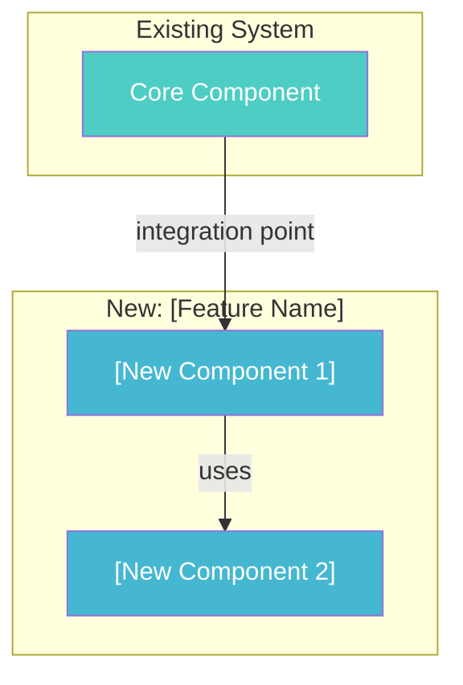
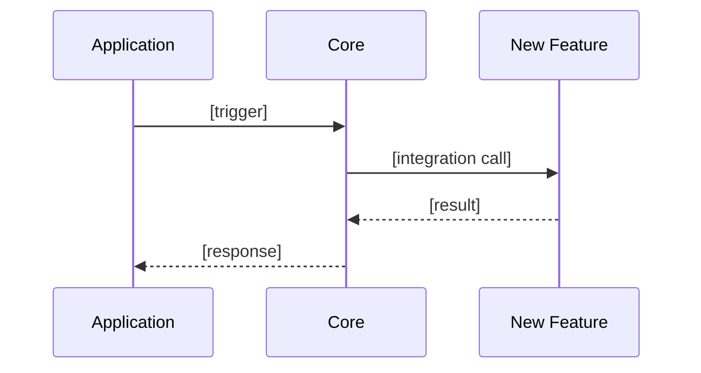
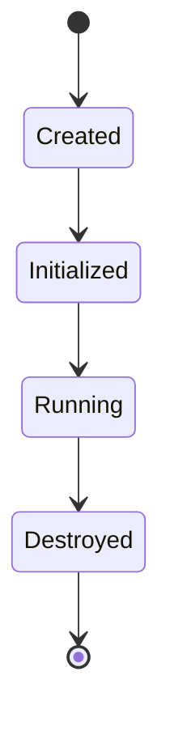

# Tutorial Chapter Template (Core-First — 10-Section Structure)

Use this template for each `core-docs/chNN_<feature_name>.md`. Adapt content to the specific feature.

**IMPORTANT**: Every chapter MUST have all 10 sections. If a section doesn't apply to this
feature, include it with: "N/A — this feature does not involve [topic]" and a brief explanation.

---

```markdown
# Chapter N: [Feature Name]

> Line references based on commit `<short-hash>` of the [Project Name] repository ([Source Language]).

## Build Challenge

| Current State                                      | Limitation                                 | Objective                                          |
|----------------------------------------------------|--------------------------------------------|----------------------------------------------------|
| [What the code looks like after previous chapters]  | [A concrete problem or missing capability] | [What the reader will build in this chapter]       |

---

## N.1 The Integration Point

[Show the EXACT code where this feature plugs into the existing system FIRST.
This is typically a modification to an existing file — the place where two
subsystems connect. Show the code before any supporting pieces exist.]

**Modifying:** `src/main/java/com/simple/<framework>/<path>/ExistingClass.java`
**Change:** [Brief description of the integration — e.g., "Add argument resolution before handler invocation"]

```java
// The modified method showing the new integration
// This references classes/interfaces that don't exist yet — that's intentional
```

> ★ **Insight** -------------------------------------------
> - **Why this integration point?** [Why was this seam chosen over alternatives?]
> - **Trade-off:** [What design constraint does it introduce?]
> - **Recommend:** [When this integration pattern is appropriate vs. alternatives]
> -----------------------------------------------------------

This [connects Subsystem A to Subsystem B]. To make it work, we need to build:
- [Component X — what it does]
- [Component Y — what it does]
- [Component Z — what it does]

[**For foundation chapters (ch01)** with no prior system to plug into: show the core data
structure instead, and state what future features will connect to it.]

## N.2 [First Supporting Component]

[Build the first piece that the integration point requires.]

[Code-first. For NEW files, just show the code:]

**New file:** `src/main/java/com/simple/<framework>/<path>/NewClass.java`

```java
package com.simple.<framework>.<path>;

public class NewClass {
    // implementation
}
```

> ★ **Insight** -------------------------------------------
> - **Why [design decision]?** [Rationale]
> - **Trade-off:** [What was simplified vs the source project]
> - **Recommend:** [When to use this approach]
> -----------------------------------------------------------

## N.3 [Second Supporting Component]

[Continue building. Each sub-section adds one piece of the solution.]

[Add ★ Insight blocks at major design decision points]

## N.4 Try It Yourself

[Present 1-2 challenges before showing the full solution. The code already exists in src/, so the user can peek if needed — or delete and try from scratch.]

<details>
<summary>Challenge: [Descriptive challenge title]</summary>

[Hint or starting point]

```java
// Solution code
```

</details>

## N.5 Tests

### Unit Tests

**New file:** `src/test/java/com/simple/<framework>/<path>/FeatureTest.java`

```java
package com.simple.<framework>.<path>;

import org.junit.jupiter.api.Test;
import static org.assertj.core.api.Assertions.*;

class FeatureTest {

    @Test
    void shouldDoExpectedBehavior_WhenCondition() {
        // Arrange
        ...

        // Act
        ...

        // Assert
        assertThat(result).isEqualTo(expected);
    }

    @Test
    void shouldHandleAnotherCase_WhenDifferentCondition() {
        ...
    }
}
```

### Integration Tests

[Only include if this feature interacts with prior features]

**New file:** `src/test/java/com/simple/<framework>/integration/FeatureIntegrationTest.java`

```java
package com.simple.<framework>.integration;

import org.junit.jupiter.api.Test;
import static org.assertj.core.api.Assertions.*;

class FeatureIntegrationTest {

    @Test
    void shouldIntegrateWithPriorFeature_WhenUsedTogether() {
        ...
    }
}
```

**Run:** `./mvnw test` — expected: all tests pass (including prior features' tests)

---

## N.6 Why This Works

[Explain the design decisions AFTER the reader has seen and run the code.]

> ★ **Insight** -------------------------------------------
> - **Why [core design decision]?** [Deep rationale with alternatives considered]
> - **Trade-off:** [What was sacrificed, downsides, when this choice might be wrong]
> - **Recommend:** [For the learner: when to use this approach in real projects]
> - **Where:** [→ src/path/File.java — methodName]
> - **When:** [During init? Runtime?]
> - **How to verify:** [Test or check that confirms understanding]
> -----------------------------------------------------------

[1-3 insight blocks. Focus on WHY the design works, not WHAT the code does.
Topics should cover:
- Integration point choice justification
- Simplification decision reasoning
- Pattern selection rationale
- How the source project handles this differently and why]

## N.7 What We Enhanced

[Mandatory for all chapters after ch01. For ch01, show foundation table.]

{{FOR CHAPTER 1:}}

**Foundation established.** This chapter created the core that future features build on:

| Component | What Was Created | Purpose |
|-----------|-----------------|---------|
| [component] | [what was built] | [why it exists] |

{{FOR CHAPTER 2+: This table is MANDATORY.}}

| Aspect    | Before (chNN)             | Current (this chapter)      | Source Project                                |
|-----------|---------------------------|-----------------------------|-----------------------------------------------|
| [Concern] | [Previous simplification] | [What this chapter improved] | [Production approach with `File.java:line`]  |

## N.8 Connection to Source Project

| Simplified Java Code  | Source Project Code ([Language]) | File:Line           | Key Difference                  |
|-----------------------|---------------------------------|---------------------|---------------------------------|
| `SimpleClass`         | `SourceType`                    | `source_file:42`    | [What the source version adds]  |
| `simpleMethod()`      | `source_func()`                 | `source_file:108`   | [What the source version handles] |

{{FOR non-Java source projects, add Technology Mapping:}}

**Technology Mapping ([Source Language] → Java):**

| Source Construct | Java Equivalent | Why This Mapping |
|-----------------|----------------|------------------|
| [e.g., `@app.route` decorator] | [e.g., `@Route` annotation + `RouteRegistry`] | [Preserves declarative routing pattern] |
| [e.g., goroutine] | [e.g., `ExecutorService.submit()`] | [Lightweight concurrency → thread pool] |

Verified against commit: `<short-hash>`

## N.9 Architecture Visualization

<!-- diagram: ch{{NN}}_{{feature_slug}}_integration -->


{{Additional diagrams as needed:}}

{{FOR features with complex execution flows:}}
<!-- diagram: ch{{NN}}_{{feature_slug}}_flow -->


{{FOR features with lifecycle/state changes:}}
<!-- diagram: ch{{NN}}_{{feature_slug}}_lifecycle -->


## N.10 Complete Code

[ALL files created or modified in this chapter, shown in full.]
[This section is generated by READING BACK the actual source files from src/.]
[Include both production code AND test code.]

### Production Code

#### File: `src/main/java/com/simple/<framework>/<path>/NewClass.java` [NEW]

```java
[Full file content — read from the actual file]
```

#### File: `src/main/java/com/simple/<framework>/<path>/ModifiedClass.java` [MODIFIED]

```java
[Full file content — read from the actual file, showing the complete file after modification]
```

### Test Code

#### File: `src/test/java/com/simple/<framework>/<path>/FeatureTest.java` [NEW]

```java
[Full file content — read from the actual file]
```

#### File: `src/test/java/com/simple/<framework>/integration/FeatureIntegrationTest.java` [NEW]

```java
[Full file content — read from the actual file]
```

---

## Summary

| Concept              | What It Means           |
|----------------------|-------------------------|
| **[Term 1]**         | [One-line explanation]   |
| **[Term 2]**         | [One-line explanation]   |
| **[Pattern name]**   | [One-line explanation]   |

**Next: Chapter N+1 — [Next Feature Name]** — [One-sentence preview of what comes next and why it's needed]
```

---

## Template Rules

1. **All 10 sections**: Every chapter has N.1 through N.10. Mark inapplicable sections "N/A — this feature does not involve [topic]" rather than omitting.
2. **Build Challenge**: ONE row only. Current state → Limitation → Objective.
3. **Integration point comes FIRST**: Show the exact code where this feature connects, then state direction.
4. **★ Insight blocks at decision points**: In N.1-N.3 (implementation) AND N.6 (Why This Works), with minimum Why + Trade-off + Recommend.
5. **Code before explanation**: Show the code, then explain what it does and why.
6. **File annotations**: Every code block header states the file path and `[NEW]` or `[MODIFIED]`.
7. **Modified files**: State the file, describe the change, show the specific change.
8. **Complete Code**: Generated by reading actual `src/` files. Must match reality exactly.
9. **Architecture Visualization (N.9)**: At least one Mermaid diagram per chapter, using standardized color palette and `<!-- diagram: slug -->` markers.
10. **What We Enhanced (N.7)**: Foundation table for ch01. MANDATORY enhancement table for ch02+.
11. **Copy-paste guarantee**: If reader copies `[NEW]` files and replaces `[MODIFIED]` files, the project compiles and all tests pass.
12. **Mermaid diagrams**: Use standardized 7-color palette, `<!-- diagram: slug -->` comment markers, labeled arrows, subgraphs for logical grouping.
13. **Emoji markers**: 🔑 Essential, ⚠️ Pitfall, 🚫 Constraint, ★ Insight, 🔗 Integration point — used consistently.
