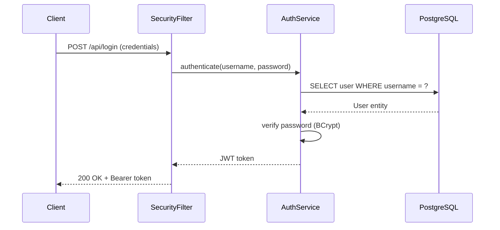

# Techniques for Enterprise Java Learning Tutorials

These techniques create tutorials that teach enterprise Java by re-implementing real projects
from any language. Every technology choice and design decision is a teaching moment.

---

## 1. Module Contract First

**What**: Show the feature's contract — what it provides to clients/consumers — before any
implementation code. For applications: REST endpoints, service interfaces. For libraries:
public API. For frameworks: extension interfaces.

**Why**: This mirrors how developers actually work in enterprise environments — they design
contracts first (OpenAPI specs, interface definitions, service boundaries) then implement.
Starting with the contract creates immediate motivation: "I can see what this feature
provides, now I want to know how it's built."

**Structure for Applications**:
```
REST API:
  POST /api/users
  Request:  { "name": "Alice", "email": "alice@example.com" }
  Response: { "id": 1, "name": "Alice", "email": "alice@example.com" }
```

**Structure for Libraries**:
```java
public interface HttpClient {
    Response get(String url);
    Response post(String url, Object body);
}
```

---

## 2. Client Test as Specification

**What**: Write tests from the client's perspective BEFORE implementation. For applications,
these are integration tests (with Testcontainers). For libraries/frameworks, these are plain
JUnit tests against the public API.

**Why**: Tests-first is a pedagogical tool here. The test IS the specification. When a reader sees:

```java
@Test
void shouldCreateUser_WhenValidRequest() {
    var response = restClient.post("/api/users", newUserRequest);
    assertThat(response.statusCode()).isEqualTo(201);
    assertThat(response.body().id()).isNotNull();
}
```

They immediately understand what the feature does WITHOUT reading explanation text.

**Naming**: Use `should<ExpectedBehavior>_When<Condition>`. Test names are sentences that
describe the behavioral contract.

**Application tests use Testcontainers** — real PostgreSQL, Redis, Kafka in containers:
```java
@Container
static PostgreSQLContainer<?> postgres = new PostgreSQLContainer<>("postgres:16");
```

**Library/Framework tests use plain JUnit** — no containers, no Spring:
```java
@Test
void shouldSerializeRecord_WhenCalledWithValidInput() {
    var result = serializer.serialize(new User("Alice", 30));
    assertThat(result).contains("\"name\":\"Alice\"");
}
```

---

## 3. Technology Substitution as Teaching Moment

**What**: Every time a source technology is replaced by a Java equivalent, explain WHY with
a ★ Insight block — not just "we used X instead of Y" but a deep explanation of rationale,
trade-offs, and alternatives.

**Why**: This is the core pedagogical innovation of this plugin. Technology substitutions are
the richest learning moments because they force the learner to understand:
- What the source technology does and why it was chosen
- What the Java ecosystem offers as an alternative
- What's gained and lost in the substitution
- When the Java choice might be wrong

**Format**:
```markdown
> ★ **Insight** -------------------------------------------
> - **Why PostgreSQL replaces SQLite?** Enterprise applications need concurrent write access
>   from multiple threads/processes, ACID transactions across connections, and connection
>   pooling. SQLite's single-writer lock becomes a bottleneck above ~10 concurrent users.
>   PostgreSQL handles thousands of concurrent connections with MVCC.
> - **Trade-off:** PostgreSQL requires a separate server process and more operational
>   complexity. For single-user desktop apps or mobile apps, SQLite is often the better choice.
> - **Recommend:** Use PostgreSQL for any multi-user server application. Keep SQLite for
>   embedded, single-user, or read-heavy scenarios where deployment simplicity matters.
> -----------------------------------------------------------
```

**The Deviation Case**: When no Java equivalent exists, the ★ Insight becomes even more
important. Document what's lost, what's different, and what the learner should know:

```markdown
> ★ **Insight** -------------------------------------------
> - **Why Louvain (JGraphT) replaces Leiden Algorithm?** Java lacks a mature, maintained
>   Leiden implementation. Louvain is available via JGraphT and produces similar community
>   detection results. Louvain is O(n log n) but doesn't guarantee the resolution limit
>   freedom that Leiden provides.
> - **Trade-off:** Louvain may merge communities that Leiden would keep separate. For
>   most practical datasets under 1M nodes, the difference is negligible.
> - **Recommend:** Use Louvain for general community detection. If resolution limit
>   freedom is critical, consider wrapping a Python Leiden implementation via ProcessBuilder
>   or implementing Leiden in Java (significant effort).
> -----------------------------------------------------------
```

---

## 4. Rich Mermaid Visualization

**What**: Mermaid diagrams throughout tutorials — architecture slices, data models, request
flows, technology comparisons — all using the standardized 7-color palette.

**Why**: Visual diagrams accelerate understanding of:
- System architecture (C4 diagrams)
- Data relationships (ER diagrams)
- Request processing flows (sequence diagrams)
- Technology mappings (comparison flowcharts)
- State machines (stateDiagram-v2)

**Rules**:
- Every Mermaid block has `<!-- diagram: slug_name -->` comment above it
- All arrows labeled with data type, protocol, or relationship
- Subgraphs for logical grouping
- Standardized colors: Teal (input), Blue (logic), Purple (data), Orange (infra), Red (error), Green (success), Yellow (external)
- GitHub-renderable only

**Example — Request Flow**:
```markdown
<!-- diagram: ch02_auth_request_flow -->


---

## 5. Progressive Enhancement Tracking

**What**: "What We Enhanced" table in every chapter (ch02+) showing how components grow
across features to handle new capabilities.

**Why**: Shows the reader that enterprise code evolves. Each feature enhances previous
components to support new requirements. The progression shows:
- How real enterprise codebases grow organically
- That initial simplifications are temporary
- How concerns separate as complexity increases

**Format**:
```markdown
| Component | Before (Ch 1) | Current (Ch 2) | Source Project |
|-----------|--------------|----------------|----------------|
| UserService | Create/read users | + authentication, + password hashing | Full RBAC system |
| SecurityConfig | None | JWT filter chain, BCrypt encoder | OAuth2 + session + JWT |
```

---

## 6. Try It Yourself Challenges

**What**: Collapsible `<details>` sections with challenges that extend the feature.

**Why**: Active learning beats passive reading. Challenges should follow naturally from
the chapter's feature.

**Good challenges**:
- Extend the feature with a related capability (e.g., "add email validation to user registration")
- Handle an edge case that was deferred (e.g., "add pagination to the user list endpoint")
- Add a new technology integration (e.g., "cache user lookups in Redis")

**Bad challenges**:
- Unrelated to this chapter's feature
- Require knowledge from future chapters
- Pure refactoring with no behavioral change

---

## 7. Build Challenge Framing

**What**: ONE-row table showing Current State | Limitation | Objective. Always from the
user's perspective.

**Why**: Frames the chapter as solving a concrete limitation. The reader knows exactly
what they can't do yet and what they'll be able to do after.

| Current State | Limitation | Objective |
|--------------|-----------|-----------|
| Users can register accounts | No login or authentication | Users can log in and access protected endpoints |

---

## 8. Insight Block Discipline

**What**: ★ Insight blocks appear in two places:
- **N.3 (Implementation)**: At each major design decision point
- **N.6 (Why This Works)**: 1-3 comprehensive insights per chapter

**Format**: Always minimum Why + Trade-off + Recommend. Full: + Where + When + How to verify.

**Good insight topics**:
- Why this Java technology was chosen over alternatives
- Why this enterprise pattern is used (and when it shouldn't be)
- Why the source project's approach doesn't translate directly to Java
- Why virtual threads replace the source's concurrency model
- Why real infrastructure (PostgreSQL, Redis) instead of in-memory alternatives

**Bad insight topics**:
- Describing what code does (the code is right there)
- Generic Java advice ("use interfaces for abstraction")
- Repeating what the source project's documentation says

---

## 9. Code-First Presentation

**What**: Code BEFORE explanatory text. Always.

**Why**: Code is the truth. Prose is commentary. The reader should form their own
understanding from the code, then have it confirmed by the explanation.

**Pattern**:
```markdown
### N.3.2 UserService — business logic

```java
@Service
public class UserService {
    private final UserRepository userRepository;
    private final PasswordEncoder passwordEncoder;
    // ...
}
```

The UserService receives user creation requests, hashes passwords using BCrypt,
and delegates persistence to the Spring Data JPA repository.

---

## 10. Enterprise Java Modern Features

**What**: Use Java 21+ features throughout — records, sealed classes, pattern matching,
virtual threads. Every usage is a micro-teaching moment.

**Why**: Many developers learn Java from pre-21 tutorials and miss modern features.
Using them naturally in enterprise code teaches by example.

**Records for DTOs**:
```java
public record CreateUserRequest(String name, String email) {}
public record UserResponse(Long id, String name, String email) {}
```

**Sealed classes for type hierarchies**:
```java
public sealed interface AuthResult permits AuthResult.Success, AuthResult.Failure {
    record Success(String token, User user) implements AuthResult {}
    record Failure(String reason) implements AuthResult {}
}
```

**Pattern matching**:
```java
return switch (result) {
    case AuthResult.Success s -> ResponseEntity.ok(s.token());
    case AuthResult.Failure f -> ResponseEntity.status(401).body(f.reason());
};
```

**Virtual threads**:
```java
// In application.yml:
spring.threads.virtual.enabled=true

// Or programmatically:
try (var executor = Executors.newVirtualThreadPerTaskExecutor()) {
    var futures = tasks.stream()
        .map(task -> executor.submit(task::execute))
        .toList();
}
```

---

## 11. Framework Contrast Insights (Java-to-Java)

**What**: When re-implementing a Java application from one framework to another (Quarkus →
Spring Boot, Micronaut → Spring Boot), focus on framework philosophy contrasts rather than
just syntax mapping.

**Why**: Syntax mapping is shallow ("replace @Inject with @Autowired"). Philosophy contrasts
are deep learning moments ("Quarkus optimizes for startup time via compile-time DI;
Spring optimizes for flexibility via runtime DI — and virtual threads make the reactive
trade-off Quarkus encourages less necessary").

**Format**:
```markdown
> ★ **Insight** -------------------------------------------
> - **Why Spring's runtime DI replaces Quarkus's compile-time DI?** Quarkus processes
>   DI at build time using Arc, producing a pre-wired application with sub-second startup.
>   Spring processes DI at runtime using CGLIB proxies and reflection. The trade-off:
>   Spring is more flexible (runtime profiles, conditional beans, dynamic proxies) while
>   Quarkus is faster to start. With virtual threads in Spring Boot 4, the throughput
>   difference that motivated Quarkus's reactive approach is largely eliminated.
> - **Trade-off:** Spring's runtime DI means slower startup (~2-5s vs. Quarkus's ~0.5s).
>   This matters for serverless/cold-start scenarios but not for long-running services.
> - **Recommend:** Use Spring Boot for long-running services where flexibility and
>   ecosystem breadth matter. Consider Quarkus for serverless, FaaS, or CLI tools where
>   startup time is critical.
> -----------------------------------------------------------
```

---

## 12. Source Code Mapping Tables

**What**: Per-chapter mapping (in N.8) between source technologies and Java equivalents.

**Format**:
```markdown
| Source Technology | Java Equivalent | Role in This Feature |
|-------------------|-----------------|---------------------|
| SQLite | PostgreSQL + Spring Data JPA | User persistence |
| bcrypt (Go) | Spring Security BCryptPasswordEncoder | Password hashing |
| goroutine | Virtual Thread | Async email sending |
```

Always link to the full [technology-mapping.md](../technology-mapping.md) for the complete picture.

---

## 13. Copy-Paste Guarantee

**What**: The Complete Code section (N.10) contains every file created or modified. If a
reader copies all `[NEW]` files and replaces all `[MODIFIED]` files, the project compiles
and all tests pass.

**Rules**:
- Read file content from actual `src/` files — never write from memory
- Include ALL files (production + test + configuration)
- Mark each file `[NEW]` or `[MODIFIED]`
- For applications: note that Docker must be running (`docker-compose up -d`)
- For libraries/frameworks: no Docker needed
- Order files by dependency (entities before services, services before controllers)
